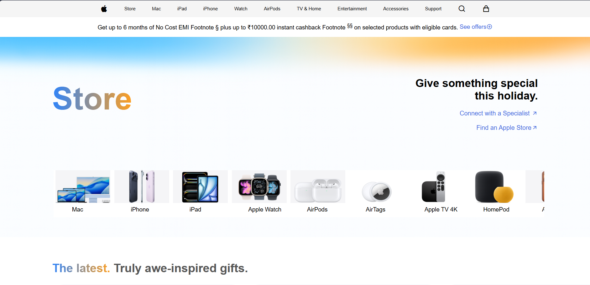
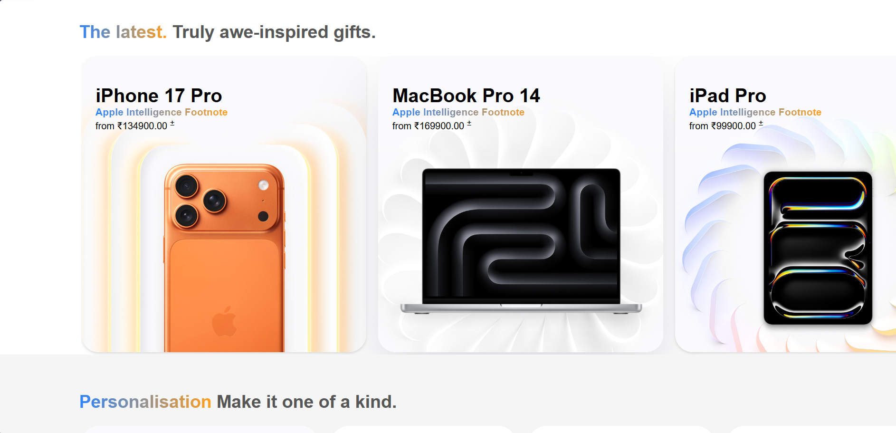
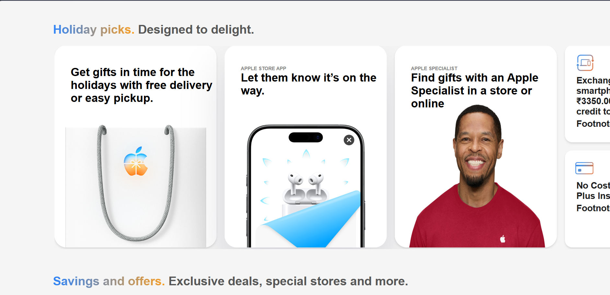
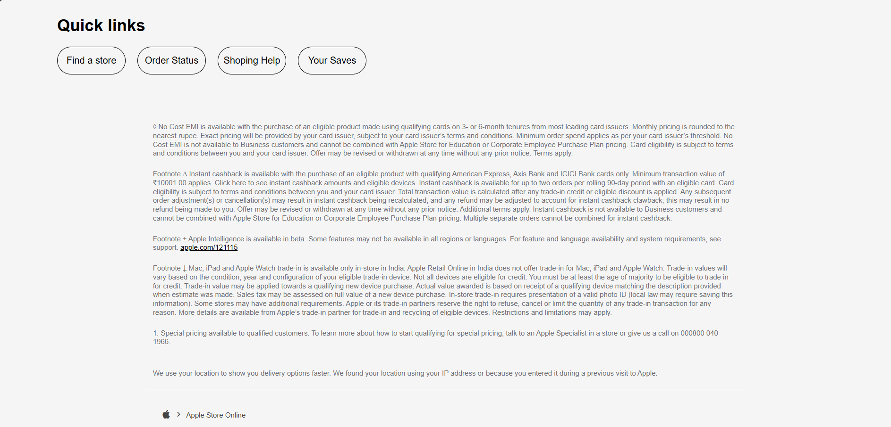

<div align="center">

# 🍎 Apple Store UI Clone

### A modern Apple Store landing page clone built with React & CSS



<br>


</div>

---

# ✨ Overview

This project is a front-end recreation of Apple's official online store. It focuses on delivering Apple's minimal design language while implementing responsive layouts, reusable React components, smooth scrolling sections, and clean UI interactions.

---

# 📸 Preview

## Landing Page


---

## Product Showcase



---

## Holiday Collection



---

## Footer & Quick Links



---

# 🚀 Features

- 🍎 Apple-inspired modern UI
- 📱 Fully Responsive Design
- ⚡ React Component Architecture
- 🎨 Clean CSS Styling
- 🛍️ Product Cards
- 🎁 Holiday Picks Section
- 🖼️ Horizontal Scroll Cards
- 🔍 Navigation Bar
- 📌 Quick Links
- 📄 Apple Footer Recreation

---

# 🛠 Tech Stack

| Technology | Usage |
|------------|-------|
| React | UI Development |
| JavaScript | Functionality |
| CSS3 | Styling |
| HTML5 | Structure |

---

# 📂 Project Structure

```
src/
│
├── components/
├── pages/
├── css/
├── assets/
└── App.jsx
```

---

# 🎯 What I Learned

- Building reusable React components
- Responsive layouts using CSS
- Component-based architecture
- UI cloning from production websites
- Clean folder organization
- Front-end performance optimization

---

# 📱 Responsive

✔ Desktop

✔ Laptop

✔ Tablet

✔ Mobile

---

# 📌 Future Improvements

- Dark Mode
- Product Search
- Shopping Cart UI
- Authentication
- Backend Integration
- Animations using GSAP

---

# 👨‍💻 Author

**Abhinav Sahoo**

B.Tech CSE (Data Science)

Aspiring Full Stack Web Developer

Interested in AI & Machine Learning

GitHub: https://github.com/Abhinav-Sahoo-04

---

<div align="center">

### ⭐ If you like this project, consider giving it a Star!

</div>
